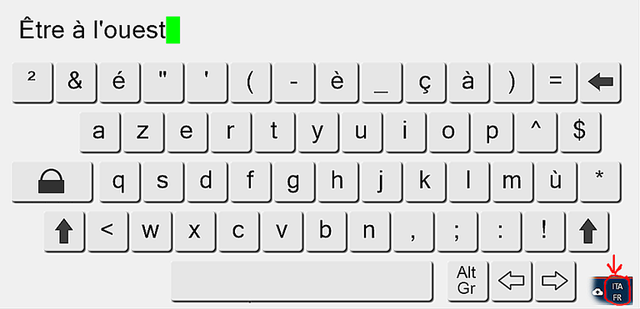

# TouchKB

A Winform touch keyboard that automatically supports multiple international layouts

## Getting Started

It is a component for Windows written in C # that allows you to edit a text field using the mouse, a touch panel or the keyboard. This touch keyboard automatically changes the layout following the one set in the operating system. In the images below it is possible to view some keyboard layouts.

Italian

French  

German

Spanish

Obviously almost all layouts managed by Windows are supported. 

Since not all touch screens support multiple touch points, this component is capable of handling keystrokes to obtain code-points such as capital letters, numbers or punctuation symbols. For example pressing the [Shift] key the keyboard layout changes like this:

Also the [Alt-Gr] key alters keyboard layout:

Control key combinations such as [Alt-Gr] + [Shift] are also managed:

### Prerequisites

Visual Studio is required: it should also work with older versions than VS2013.

### Installation, Deployment and Usage

Just open the project in visual studio. Compile it and run to test the component. Next you can use the generated assembly or directly the component in your code.

The resulting text is in the component's Text property.

## License

This project is licensed under the "The Unlicense".
